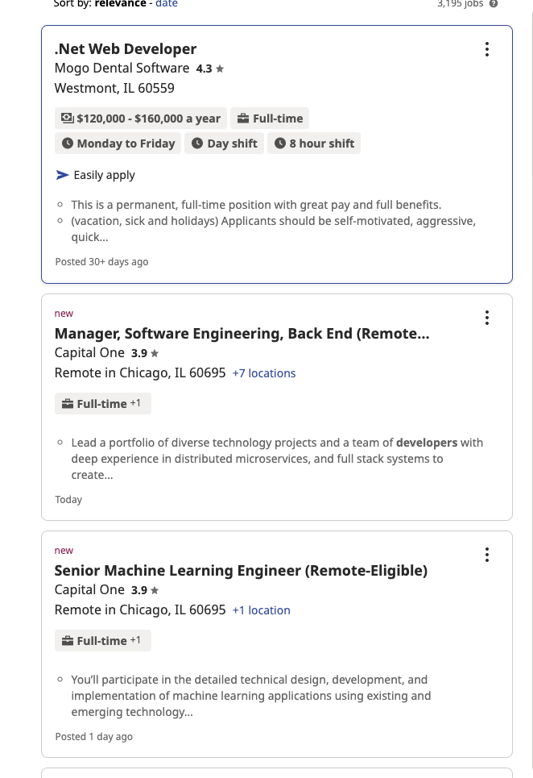

## Two Heuristics

As of writing this, my website is still not very close to it's finished state. 
I'm sure there are many more features that will be added to increase usability and 
functionality. Right now, I still don't have data displaying to the webpage, so it 
is hard to think about heuristic improvements. Nevertheless, here are some potential 
fixes/features.

### 1. Table Display Style (Aesthetic and Minimalist Design)

I've watched a few youtube videos on displaying table data in a well designed manner 
that would be pleasant for the user. I'm picturing a vertical list with 1 column and 
n number of rows, (n being the number of results). Each list will contain the elements 
given from the API (charity name, website, location, mission statement, etc.). The design 
will be subject to change but I'm imagining something similar to indeed.com. 

### 2. Home/Navigation Optimization (User Control and Freedom)

I have been indecisive about how I should go about navigation for this website. 
Since the main function of the website is searching, I think search should be the home 
screen. However, if search is the home screen, then that's 1 less page to meet the 
qualifications for the project. The pages, as of right now, are: home, about, list. 
Perhaps these could change to: Home(Search), about, searchResults(list), and 
recentSearches. So from the home(search) page, you can either enter a search phrase, or 
navigate using the nav bar to: about and recentSearches. I also thought about adding 
a "Favorite Charities" subsection to the home page that would show my favorite charities 
and their website and mission statement.

