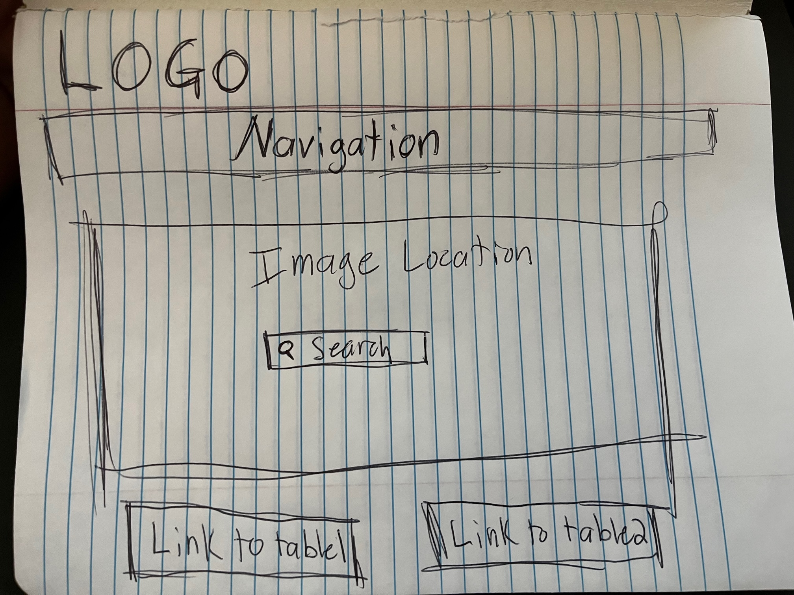
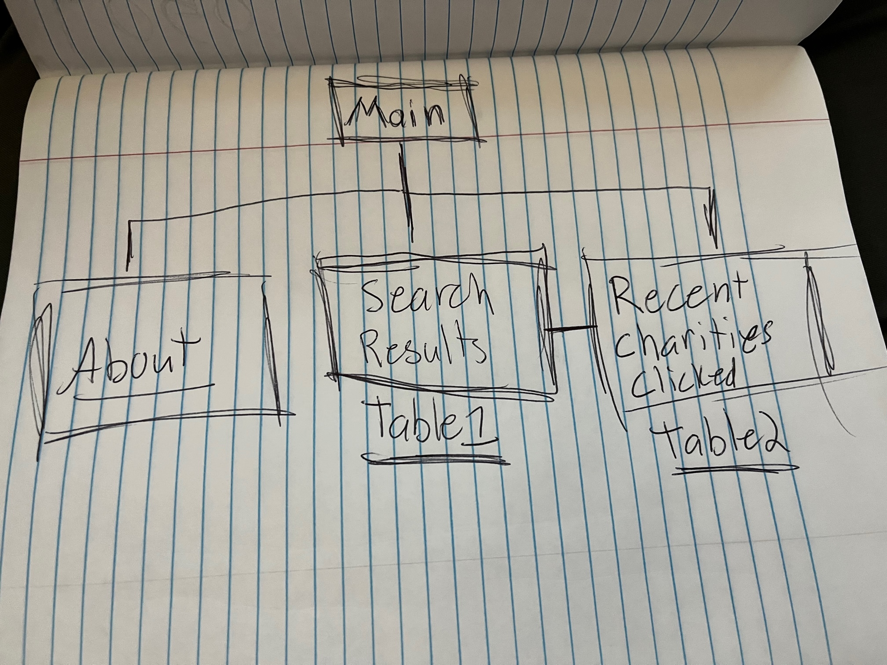

// Markdown Proposal

# Charity Finder

This website is dedicated to the access and exposure of charitable organizations globally. 
You will be able to search for charities by name and follow the given links to those charities' 
websites for further information and donation possibilities. This "Search Results" table will 
populate with the charities most associated with the user's search terms. There will be a second 
page that will have a table that displays the most recent searches/links clicked so the user 
can identify what others have been recently viewing/ donating to. 

## Web Service

This service uses API for authentification. 
* http://data.orghunter.com/v1/charitysearch using a Post request.

### Database

The database for this website will be used for the Search Results page to read from so the user 
can identify charities and find links to those charities' websites. The charity API will be used 
to write to the database for the website to access. The first table, Table1, will be for displaying 
the results from a user's search. The second table, Table2, will be for displaying recent searches/ clicks 
for the user to identify charities that recent users have visited/ searched for. Table2 will either display 
a list of the most recent searches or display a list of the most recently visited charities. The 
relationship between the tables will be the use of the ID Primary Key for Table1 to display to Table2 
using a FK of ID.

### Initial Design

